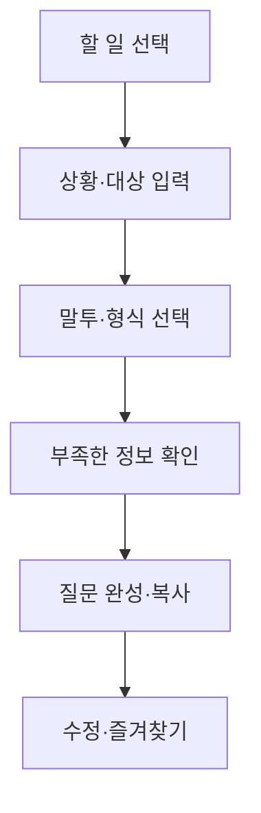

# AI 생활질문 코치 MVP 기획안

## 기획 한 줄

AI 초보자가 프롬프트를 공부하거나 검색하지 않아도, 자신의 상황을 몇 번 선택하고 짧게 설명하면 바로 복사해 쓸 수 있는 좋은 질문을 완성해 주는 모바일 우선 웹앱이다.

## 참고 자료에서 가져온 설계 원칙

- 《프롬프트 77》: 좋은 질문은 역할, 상황, 대상, 목적, 형식, 말투, 분량, 제약 조건이 구체적이다.
- 《AI 기초용어 완전 정복》: 용어는 사전식 정의보다 일상 비유와 실제 사용 장면으로 설명해야 한다.
- 《구글 나노 바나나 62가지 사용법 정리》: 이미지 프롬프트는 대상, 변환 목적, 스타일, 구도, 비율, 조명, 유지할 요소와 제외할 요소를 구조화해야 한다.

자료의 원문을 그대로 진열하는 대신, 위 원리를 재구성해 사용자의 상황에 맞는 질문을 조립하는 데 활용한다.

---

## 1. 앱의 핵심 문제와 해결 방식

### 핵심 문제

AI 초보자는 원하는 결과는 알고 있지만 다음 세 가지에서 막힌다.

1. 무엇부터 설명해야 하는지 모른다.
2. 자신의 짧은 요구를 구체적인 질문으로 바꾸기 어렵다.
3. 나온 답이 마음에 들지 않아도 어떻게 다시 요구해야 하는지 모른다.

프롬프트 모음은 예시는 많지만, 내 상황과 맞는 문장을 찾아 고치는 일이 다시 사용자의 몫이라는 한계가 있다.

### 해결 방식

앱은 프롬프트를 보여주는 도서관이 아니라 질문을 함께 만드는 안내자가 된다.

- 사용자가 먼저 ‘하려는 일’을 고른다.
- 상황, 대상, 말투, 형식과 길이를 쉬운 말로 묻는다.
- 꼭 필요한 정보가 빠졌을 때만 추가 질문을 1~3개 제시한다.
- 입력값을 역할 + 상황 + 목표 + 조건 + 출력 형식의 구조로 자동 조립한다.
- 완성된 질문과 함께 ‘왜 더 좋은 질문인지’를 짧게 보여준다.
- 결과가 마음에 들지 않을 때 누를 수 있는 수정 명령을 제공한다.

핵심 성공 지표는 프롬프트 개수가 아니라 ‘첫 방문자가 3분 안에 질문 하나를 완성하고 복사하는 비율’이다.

---

## 2. 앱 이름 후보 10개

| 이름 | 의미와 인상 |
|---|---|
| 바로묻기 | 기능이 즉시 이해되고 초보자에게 부담이 없다. |
| 질문한걸음 | AI 사용의 첫걸음을 돕는다는 의미다. |
| AI 질문친구 | 친근하고 시니어 대상 교육에 잘 어울린다. |
| 생활질문 AI | 실생활 중심 앱이라는 정체성이 명확하다. |
| 물어봄 | 짧고 부드러우며 기억하기 쉽다. |
| 질문나침반 | 무엇을 어떻게 물을지 방향을 잡아준다는 의미다. |
| 말해봐 AI | 대화형 서비스의 인상을 준다. |
| 척척질문 | 쉽고 빠르게 완성된다는 느낌을 준다. |
| 질문공방 | 사용자가 자기 질문을 다듬어 만든다는 의미다. |
| 프롬프트 메이트 | 프리랜서와 직장인에게 비교적 전문적으로 들린다. |

추천 작업명은 **바로묻기**다. 다만 실제 서비스명 확정 전에는 상표, 도메인, 앱스토어 중복 여부를 별도로 확인해야 한다.

---

## 3. 핵심 사용자 3명과 사용 상황

### 사용자 A: 60대 지역사회 활동가

- 필요: 행사 안내, 회원 격려, 감사 인사, 회의 발언, 페이스북 글
- 어려움: 머릿속 내용은 분명하지만 글의 순서와 말투를 잡기 어렵다.
- 대표 이용: ‘클럽대항전 선수들에게 따뜻하지만 과하지 않은 격려문을 300자로 작성’하는 질문을 완성한다.

### 사용자 B: 1인 프리랜서·소상공인

- 필요: 고객 답변, 판매 글, 홍보 콘텐츠, 제안서, 이미지 제작
- 어려움: 같은 내용을 채널과 고객에 맞게 바꾸는 데 시간이 많이 든다.
- 대표 이용: 상품 정보 몇 가지를 입력하고 블로그용, 인스타그램용, 고객 문자용 질문을 각각 만든다.

### 사용자 C: 교사·공무원·교육 관계자

- 필요: 보고서, 회의록, 정책 요약, 강의안, 어려운 용어 설명
- 어려움: 결과의 대상, 근거, 형식과 분량을 한 번에 지정하기 어렵다.
- 대표 이용: 자료를 바탕으로 관리자 보고용 1쪽 요약을 만드는 질문을 완성한다.

---

## 4. MVP에 반드시 필요한 기능

### P0: 출시 필수

1. **상황으로 찾기**
   - ‘글을 쓰고 싶어요’, ‘메시지를 보내야 해요’, ‘보고서를 만들어요’처럼 행동 중심 문구를 사용한다.
   - 8개 카테고리, 각 4~6개 대표 상황으로 시작한다.

2. **4단계 질문 만들기**
   - 1단계: 무엇을 하려는가
   - 2단계: 어떤 상황인가
   - 3단계: 누구에게, 어떤 말투로 전달하는가
   - 4단계: 어떤 형식과 길이를 원하는가

3. **빈칸형 프롬프트 양식**
   - 긴 입력란보다 선택 버튼과 한두 문장 입력을 우선한다.
   - 예시 문장을 입력칸 아래에 항상 보여준다.

4. **부족한 정보 확인**
   - 템플릿별 필수 항목이 비었을 때만 최대 3개를 다시 묻는다.
   - 건너뛰기와 ‘AI가 적절히 정하기’를 제공한다.

5. **최종 프롬프트 생성·복사**
   - 완성된 질문을 큰 글씨로 보여준다.
   - 전체 복사와 ‘AI에서 사용하기’ 안내를 제공한다.
   - 1차 버전의 실행은 복사 중심으로 하고, 앱 안에서 AI 답변을 생성하는 기능은 후속 단계로 둔다.

6. **질문 개선과 전후 비교**
   - 사용자가 직접 쓴 질문을 붙여 넣으면 누락된 요소를 표시한다.
   - ‘처음 질문 / 개선된 질문’을 나란히 보여준다.
   - 역할, 상황, 대상, 목적, 형식, 말투, 분량, 주의사항의 충족 여부를 체크한다.

7. **결과 수정 명령 버튼**
   - 더 짧게 / 더 자세히 / 더 따뜻하게 / 더 전문적으로 / 쉬운 말로
   - 선택하면 기존 프롬프트 끝에 자연스러운 후속 요청을 붙인다.

8. **검색·즐겨찾기·최근 사용**
   - 템플릿 이름과 상황 키워드 검색
   - 브라우저 저장소를 활용한 즐겨찾기와 최근 사용
   - 로그인은 요구하지 않는다.

9. **AI 용어 도움말**
   - 프롬프트, 생성형 AI, LLM, 토큰, 맥락, 환각, API 등 핵심 용어부터 시작한다.
   - ‘한 줄 뜻 → 일상 비유 → 언제 쓰는 말인가’ 순서로 설명한다.

10. **사진 기반 이미지 프롬프트 도우미**
    - 사진을 브라우저에서 미리보기 한다.
    - 사용자가 ‘보정, 배경 변경, 합성, 일러스트, 홍보 이미지’ 중 목적을 고른다.
    - 스타일, 비율, 유지할 것, 바꿀 것을 선택하면 ‘첨부한 사진을 참고하여…’ 형식의 프롬프트를 만든다.
    - MVP에서는 사진을 서버로 전송하거나 자동 판독하지 않는다. 실제 사진 분석은 이용 동의와 서버 보안이 갖춰진 다음 단계에서 추가한다.

11. **안전 안내**
    - 모든 입력 화면에 ‘주민번호, 연락처, 계좌, 비밀번호, 고객 실명, 업무 기밀을 입력하지 마세요’를 표시한다.
    - 건강·법률 카테고리에는 참고용 안내와 전문가 확인 문구를 결과 화면에도 표시한다.

12. **시니어 친화 UI**
    - 기본 본문 18px 이상, 충분한 대비, 큰 터치 영역
    - 한 화면에 한 가지 결정만 요청
    - 아이콘만 쓰지 않고 항상 글자 라벨 병기
    - 뒤로 가도 입력 내용 유지

### MVP 출시 기준

- 대표 템플릿 32~40개
- 핵심 AI 용어 15~20개
- 이미지 활용 시나리오 10개
- 모바일에서 질문 완성까지 3분 이내
- 회원가입, 결제, 서버 데이터베이스, 앱 내 AI 실행은 제외

---

## 5. 나중에 추가할 기능

### 2단계: 핵심 가치가 확인된 뒤

- 서버를 통한 AI 답변 생성과 후속 수정
- 사진 내용 자동 인식 및 맞춤 이미지 프롬프트 추천
- 음성으로 상황 말하기와 결과 읽어주기
- 사용자 직업·선호 말투를 반영하는 ‘나만의 기본 설정’
- 여러 AI 서비스에 맞춘 프롬프트 변환
- 프롬프트 공유 링크와 가족·팀용 모음

### 3단계: 수익화 이후

- 교사, 공무원, 농업인, 소상공인, 시니어 강사용 전문 팩
- 강사 전용 수업 모드와 실습 과제
- 기관용 공동 템플릿과 관리자 기능
- 사용 결과를 바탕으로 한 개인 질문 코칭 리포트
- 프롬프트·이미지 결과의 버전 관리

---

## 6. 전체 화면 구성

### 하단 메뉴 4개

1. **홈**: 상황별 큰 카드, 최근 사용, 추천 상황
2. **찾기**: 카테고리, 검색, 전체 템플릿
3. **보관함**: 즐겨찾기, 최근 만든 질문
4. **AI 도움말**: 기초 용어, 개인정보·안전 안내

### 주요 화면

| 화면 | 핵심 요소 |
|---|---|
| 시작 화면 | ‘오늘 AI로 무엇을 하고 싶으세요?’와 8개 큰 카드 |
| 상황 목록 | 대표 상황, 짧은 설명, 검색 필터 |
| 질문 만들기 | 단계 표시, 선택 버튼, 짧은 입력, 예시, 건너뛰기 |
| 추가 확인 | 빠진 정보만 최대 3개 질문 |
| 완성 화면 | 최종 프롬프트, 복사, 즐겨찾기, 수정 버튼 |
| 질문 개선 | 원문과 개선문 비교, 누락 요소 표시 |
| 사진 프롬프트 | 사진 미리보기, 변환 목적·스타일·비율·유지 요소 선택 |
| 용어 도움말 | 쉬운 뜻, 비유, 실제 예시, 관련 용어 |
| 안전 안내 | 개인정보, 의료·법률, 저작권 안내 |

---

## 7. 사용자 이용 흐름



### 예시 흐름

1. 사용자가 ‘인간관계와 메시지’를 선택한다.
2. ‘행사 참석 안내’를 고른다.
3. 상황에 ‘금요일 오후 6시, 경희횟집’을 입력한다.
4. 대상은 ‘단체 회원’, 말투는 ‘따뜻하고 예의 있게’를 고른다.
5. 형식은 ‘카카오톡 공지’, 길이는 ‘300자 이내’를 고른다.
6. 앱은 참석 여부 회신 기한이 빠졌다고 알려주고 입력 여부를 묻는다.
7. 완성된 프롬프트를 복사한 뒤 원하는 AI에서 실행한다.

---

## 8. 카테고리와 프롬프트 데이터 구조

### 초기 카테고리와 대표 상황

| 카테고리 | 대표 상황 |
|---|---|
| 글쓰기와 SNS | 페이스북 칼럼, 블로그, 캡션, 숏폼 대본, 제목 |
| 업무와 보고서 | 회의록, 보고서, 제안서, 발표 구성, 자료 요약 |
| 인간관계와 메시지 | 감사, 축하, 위로, 거절, 안내, 격려 |
| 학습과 AI 용어 | 쉬운 설명, 요약, 공부 계획, 플래시카드, 퀴즈 |
| 건강·운동·생활 기록 | 증상 정리, 병원 질문, 운동 계획, 하루 기록 |
| 여행과 행사 | 일정, 준비물, 행사 순서, 인사말, 여행 후기 |
| 이미지 생성·편집 | 사진 보정, 배경 변경, 합성, 포스터, 일러스트 |
| 나만의 프롬프트 | 자유 입력, 질문 진단, 개선, 저장 |

### 템플릿 JSON 예시

```json
{
  "id": "relationship-event-notice",
  "category": "relationship",
  "title": "행사 참석 안내문",
  "searchKeywords": ["행사", "모임", "공지", "참석"],
  "description": "회원이나 지인에게 모임을 알리고 참석 여부를 묻습니다.",
  "fields": [
    {"key": "event", "label": "어떤 행사인가요?", "type": "text", "required": true},
    {"key": "datePlace", "label": "언제, 어디에서 하나요?", "type": "text", "required": true},
    {"key": "audience", "label": "누구에게 보내나요?", "type": "choice", "required": true},
    {"key": "tone", "label": "어떤 느낌으로 쓸까요?", "type": "choice", "required": true},
    {"key": "length", "label": "길이는 어느 정도가 좋을까요?", "type": "choice", "required": false}
  ],
  "promptPattern": "너는 친절한 행사 안내문 작성자다. 다음 정보를 바탕으로 {audience}에게 보낼 안내문을 작성하라. 행사: {event}. 일시와 장소: {datePlace}. 말투: {tone}. 길이: {length}. 핵심 정보를 빠뜨리지 말고 참석 여부를 자연스럽게 물어라.",
  "safetyType": "general",
  "revisionCommands": ["shorter", "warmer", "formal"]
}
```

### 용어 데이터 예시

```json
{
  "term": "환각",
  "english": "Hallucination",
  "oneLine": "AI가 사실이 아닌 내용을 그럴듯하게 말하는 현상입니다.",
  "analogy": "모르는 문제의 답을 아는 척 지어내는 것과 비슷합니다.",
  "action": "중요한 사실, 수치, 출처는 원문이나 신뢰할 수 있는 자료로 다시 확인하세요."
}
```

---

## 9. 기존 프롬프트 모음과 차별화되는 점

| 기존 프롬프트 모음 | 바로묻기 |
|---|---|
| 목록에서 비슷한 예시를 직접 찾는다. | 생활 상황을 먼저 선택한다. |
| 사용자가 빈칸과 문장을 스스로 고친다. | 쉬운 질문에 답하면 자동 조립된다. |
| 프롬프트를 제시하고 끝난다. | 부족한 정보를 확인하고 수정 명령까지 제공한다. |
| 초보자가 용어와 구조를 이해하기 어렵다. | 용어를 누르면 비유와 예시가 나타난다. |
| 양이 많을수록 좋아 보인다. | 3분 안에 실제 질문 하나를 완성하는 데 집중한다. |
| 텍스트와 이미지 프롬프트가 분리되어 있다. | 같은 생활 목적 안에서 글과 이미지 질문을 연결한다. |

가장 중요한 차별점은 **프롬프트를 제공하는 서비스가 아니라, 사용자의 생각을 질문으로 구조화하는 서비스**라는 점이다.

---

## 10. 수익화 가능성

### 가장 현실적인 순서

1. **무료 기본 서비스**
   - 대표 상황과 질문 개선 기능을 무료로 제공해 사용성을 검증한다.

2. **직업·목적별 유료 팩**
   - 시니어 생활, 교사·공무원 보고서, 소상공인 홍보, SNS 글쓰기 등 전문 템플릿을 일회성 상품으로 판매한다.

3. **교육 결합 상품**
   - 오프라인 또는 온라인 AI 강의에 앱 실습권, 워크북, 직업별 템플릿을 묶는다.
   - 사용자의 시니어 스마트폰·AI 강의 경험과 특히 잘 맞는 모델이다.

4. **기관 라이선스**
   - 복지관, 평생학습관, 학교, 지자체 교육용으로 기관 전용 템플릿과 수업 모드를 제공한다.

5. **선택형 구독**
   - AI 직접 실행, 음성 입력, 개인 기본 설정, 무제한 보관이 필요해진 뒤 도입한다.

초기에는 광고보다 교육·전문 팩 판매가 적합하다. 광고는 시니어 사용자의 집중과 신뢰를 떨어뜨릴 수 있다. 가격은 개발 전에 정하지 말고, 무료 체험 사용자 인터뷰와 결제 의향 테스트를 거쳐 결정한다.

---

## 11. 저작권·개인정보·의료 및 법률 관련 주의점

### 저작권

- 참고 PDF의 문장, 설명, 이미지, 프롬프트를 허락 없이 그대로 대량 수록하지 않는다.
- 아이디어와 구조를 참고해 새 문장과 새 분류 체계로 재작성한다.
- 자료별 저작권자와 상업적 이용·재배포 허용 범위를 확인한다.
- 이용자가 올린 사진과 생성 결과의 권리·책임에 관한 약관을 마련한다.
- 워터마크 제거처럼 권리 침해에 악용될 수 있는 기능은 기본 템플릿에서 제외한다.

### 개인정보와 보안

- 주민등록번호, 주소, 연락처, 계좌, 비밀번호, 고객 실명, 학생 정보, 업무 기밀 입력을 금지하도록 반복 안내한다.
- MVP 입력값과 즐겨찾기는 브라우저에만 저장하며, 서버 전송이 없다는 사실을 명확히 표시한다.
- 브라우저 저장 전체 삭제 버튼을 제공한다.
- AI API를 추가할 때는 비밀키를 프런트엔드 코드에 넣지 않고 서버에서 관리한다.
- 입력 내용 보관 여부, 보관 기간, 외부 AI 전송 여부를 사용 전에 알린다.

### 의료·법률

- 진단, 처방, 법률 판단을 내리는 표현을 사용하지 않는다.
- 증상 정리, 병원 방문 준비, 전문가에게 물어볼 질문을 만드는 용도로 제한한다.
- 응급 가능성이 있는 증상에는 즉시 지역 응급기관에 연락하도록 안내한다.
- 법률 결과는 계약 검토 준비와 쟁점 정리용으로 제한하고, 중요한 결정은 전문가 확인을 권한다.

### AI 결과의 신뢰성

- 사실, 수치, 인용, 최신 정보는 별도 확인이 필요하다고 알린다.
- 사용자가 ‘출처 표시’와 ‘모르는 것은 모른다고 답하기’를 프롬프트에 추가할 수 있게 한다.

---

## 12. 실제 개발에 사용할 기술 구성

### 1차 버전 권장 구성

| 영역 | 권장 기술 | 이유 |
|---|---|---|
| 프런트엔드 | React + TypeScript + Vite | 구조가 단순하고 바이브코딩으로 수정하기 쉽다. |
| 디자인 | Tailwind CSS | 큰 글씨, 간격, 반응형 화면을 빠르게 조정할 수 있다. |
| 데이터 | 로컬 JSON | 서버 없이 템플릿과 용어를 관리할 수 있다. |
| 사용자 저장 | localStorage 또는 IndexedDB | 로그인 없이 즐겨찾기와 최근 사용을 보관한다. |
| 입력 검증 | Zod 같은 스키마 검증 도구 | 템플릿 필수값과 데이터 오류를 줄인다. |
| 앱 형태 | PWA | 휴대전화 홈 화면에 설치해 앱처럼 사용할 수 있다. |
| 테스트 | Vitest + Testing Library, 기본 접근성 검사 | 질문 조립 규칙과 주요 화면을 안전하게 수정할 수 있다. |
| 배포 | 정적 웹 호스팅 | 서버 운영 부담과 비용을 최소화한다. |

### 후속 버전

- AI 호출: 서버리스 함수에서 모델 API를 호출한다.
- 계정·동기화: Supabase 같은 인증·데이터베이스 서비스를 검토한다.
- 사진 분석: 이용 동의를 받은 뒤 서버 측 비전 모델을 연결한다.
- 분석: 개인 식별 정보를 수집하지 않는 최소 이벤트 분석만 적용한다.

### 권장 폴더 구조

```text
src/
  components/
  features/
    categories/
    prompt-builder/
    prompt-improver/
    image-helper/
    glossary/
    favorites/
  data/
    categories.json
    templates.json
    glossary.json
  lib/
    prompt-engine.ts
    validation.ts
    storage.ts
  pages/
```

질문 조립 엔진은 화면 코드와 분리한다. 그래야 템플릿을 추가할 때 앱 전체를 고치지 않고 JSON 데이터만 수정할 수 있다.

---

## 최종 추천 MVP

### 추천: ‘바로묻기 - 4단계 생활질문 만들기’

첫 버전은 다음 기능으로 제한한다.

- 8개 생활 카테고리
- 검증된 대표 템플릿 32개
- 4단계 질문 만들기
- 부족한 정보 확인
- 완성 프롬프트 복사
- 5개 수정 명령
- 질문 전후 비교
- 즐겨찾기와 최근 사용
- AI 기초용어 20개
- 사진 변환용 프롬프트 도우미 10개
- 개인정보·의료·법률 안전 안내

앱 안에서 AI 답변을 직접 생성하거나 회원가입을 받는 기능은 처음에는 넣지 않는다.

### 추천 이유

1. 사용자가 정말 필요로 하는 ‘무엇을 어떻게 물을까’를 직접 해결한다.
2. 서버와 유료 API 없이 혼자 빠르게 구현하고 배포할 수 있다.
3. 입력 정보가 외부로 전송되지 않아 시니어 사용자에게 신뢰를 주기 쉽다.
4. 실제 AI 강의에서 실습 도구로 사용하며 바로 사용자 반응을 관찰할 수 있다.
5. 어떤 카테고리와 템플릿이 많이 쓰이는지 확인한 뒤 AI 실행, 음성, 사진 분석에 투자할 수 있다.

## 첫 검증 목표

시니어·프리랜서·교육 관계자 각 5명 정도에게 사용하게 하고 다음 세 가지만 확인한다.

- 설명 없이도 첫 질문을 완성할 수 있는가
- 질문 완성까지 3분을 넘지 않는가
- 완성된 질문이 본인이 직접 쓴 질문보다 실제로 유용한가

세 조건이 확인되면 2차 버전에서 앱 내 AI 실행과 음성 입력을 추가한다.
